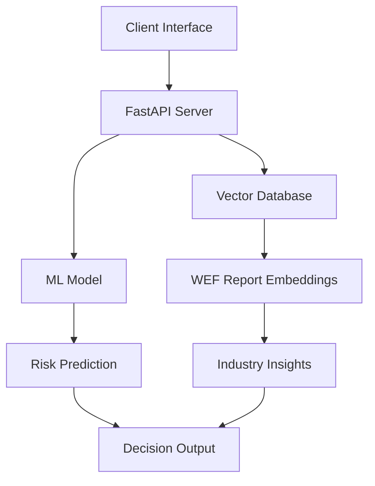

# 🏆 Raiffeisen Bank 2025 Data Hackathon: Winning Project


During 11-12 sept 2025 our team worked on:

1. Combining **internal** banking data (transactions, loans, deposits) with **external** open data (inflation, demographics, unemployment, market statistics) inside a data warehouse, identifying trends (how external factors influence customer behavior)
2. And **predict risks** (likelihood of defaults, reduced deposits, or transaction drops).

This repo covers Part 2 of our work.

---

# Abstract Idea:

To have a system that provides a way to improve decision making when deciding whether a client receives a loan based on:

- Prior internal data on loan defaults.
- Reports on clients job (industry) stability.

That returns a:

- Guess if client will default (If they are reliable)
- Insights on their job stability.


# Architecture Overview:



## Prediction Model:

Trained a prediction model with the [LogisticRegression](https://scikit-learn.org/stable/modules/generated/sklearn.linear_model.LogisticRegression.html) algorithm with data from: [Internal Dataset](https://www.kaggle.com/datasets/s3r1alsh0ck/finance-dataset-for-credit-risk-fraud-detection?resource=download) where we have imputed the default feature (values 1 or 0). Only numeric features were used.

## Retrieval Augmented Pipeline:

Used Milvus embedding model for creating word embeddings (Vectorizing) for the `WEF_Future_of_Jobs_Report_2025`, and query embeddings.

Learn about [Embeddings (Vectorization)](https://youtu.be/wjZofJX0v4M?si=7wK5jLa2KcKQMiKM&t=742).

This would query the VectorDB with the clients Occupation and send back context regarding it.
Which would be inserted in the LLM's prompt.

---

# ⚙️ Setup & Use:

To try out you must have in your machine:

- python
- pip
- node with npm

## Installation:
```
git clone https://github.com/Liburn-Krasniqi/RBKO-Data-Hackathon-Winner-2025.git
cd RBKO-Data-Hackathon-2025
```

## 💻 Client setup:

Go to:

```
cd Client
```

and run:

```
npm i  # installs node modules
npm run dev  # runs app
```

Inside the Client directory create a `.env` file where you can store your `VITE_OPENROUTER_API_KEY` .

Get key at [OpenRouter](https://openrouter.ai/settings/keys)

## ⚙️ Backend setup:

Go to:

```
cd Server
```

and run:

```
pip install -r requirements.txt  # installs requirements
uvicorn app:app --reload --port 3000  # runs server
```

---

# Tech Stack:

💻 **Frontend**: React.js with Vite\
⚙️ **Backend**: Python FastAPI\
🧠 **ML:** ScikitLearn\
📖 **LLM**: free model from OpenRouter\
📦 **Vector DB & Embedding model**: Milvus

---

**Team (DataWave):** [Diella Kika](https://github.com/diellakika), [Eron Rexha](https://github.com/EronRexha), [Lendiona Gashi](https://github.com/gashilendiona), Liburn Krasniqi, [Olt Shala](https://github.com/OltShala), [Sumea Zogaj](https://github.com/SumeaZ).

**Mentor:** Vigan Behrami.
